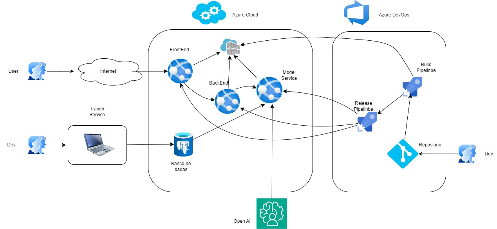

<h1 align="center">
   <a href="#">Template para Infraestrutura como Código</a><br />
   <small>(Terraform)</small>
</h1>

<h3 align="center">
    Este código Terraform implementa uma arquitetura Azure para o projeto de infraestrutura simples.
</h3>

<h4 align="center">
    Status: Em Evolução
</h4>

<p align="center">
 <a href="#sobre">Sobre</a> •
 <a href="#como-funciona">Como Funciona</a> •
 <a href="#documentacoes">Documentações</a>
</p>

---

## 📌 Sobre

Este projeto foi desenvolvido com objetivo é provisionar, via Terraform (OpenTofu), os seguintes recursos na Azure para uma aplicação de chatbot utilizando OpenAI:

- Resource Group  
- VNET  
- Subnet  
- Network Security Group  
- Tabela de Rotas  
- Banco de Dados PostgreSQL Flexible Server  
- App Service  
- App Service Plan  
- Container Registry  



---

## ⚙️ Como Funciona

### 1. Instale as dependências

- [OpenTofu](https://opentofu.org/docs/intro/install/)
- [Azure CLI](https://learn.microsoft.com/pt-br/cli/azure/install-azure-cli)

### 2. Realize login no Azure CLI

[Guia oficial](https://learn.microsoft.com/pt-br/cli/azure/authenticate-azure-cli)

### 3. Clone este repositório

```bash
git clone <URL do repositório>
cd nome-do-repositorio
```

### 4. Crie o arquivo `simple_infra.tfbackend`

Exemplo de conteúdo:

```
resource_group_name  = "RG-Simple_Infra_TFstate"
storage_account_name = "simpleinfra"
container_name       = "tfstate"
key                  = "simpleinfra.tfstate"
```

### 5. Execute os comandos para criar o container e configurar o backend

```bash
export RESOURCE_GROUP_NAME=RG-Simple_Infra_TFstate
export STORAGE_ACCOUNT_NAME=tfstatstorageacconte
export CONTAINER_NAME=tfstate
export REGION=eastus
export TAGS='managedBy=Eiji'

az login --service-principal -u ${ARM_CLIENT_ID} -p ${ARM_CLIENT_SECRET} --tenant ${ARM_TENANT_ID}
az account set --subscription ${ARM_SUBSCRIPTION_ID}

# Criar Resource Group
az group create --name $RESOURCE_GROUP_NAME --location $REGION --tags $TAGS

# Criar Storage Account
az storage account create \
  --resource-group $RESOURCE_GROUP_NAME \
  --name $STORAGE_ACCOUNT_NAME \
  --sku Standard_LRS \
  --encryption-services blob \
  --tags $TAGS

# Criar Blob Container
az storage container create \
  --name $CONTAINER_NAME \
  --account-name $STORAGE_ACCOUNT_NAME \
  --auth-mode login
```

### 6. Crie o arquivo `simpleinfra.tfvars`

Exemplo de conteúdo:

```
simple_infra_project_rg          = "RG-Simple_Infra"
simple_infra_project_vnet        = "VNet-Simple_Infra"
simple_infra_project_nsg         = "NSG-Simple_Infra"
simple_infra_project_rt          = "RT-Simple_Infra"
simple_infra_project_sbnt        = "SubNet-Simple_Infra"
simple_infra_project_domain_name = "simpleinfra"
location                         = "East US"
administrator_login              = "psqladmin"
administrator_password           = "password"
simple_infra_project_db_name     = "simpleinfradb"
simple_infra_storage_name        = "simpleinfrastorage"
simple_infra-container-tfstate   = "simpleinfracontainer"
subscription_id                  = "subscription_ID"
simple_infra_acr_name            = "simpleinfraacr"
```

### 7. Exporte as variáveis de ambiente necessárias

```bash
export ARM_CLIENT_ID="ARM_CLIENT_ID"
export ARM_CLIENT_SECRET="ARM_CLIENT_SECRET"
export ARM_TENANT_ID="ARM_TENANT_ID"
export ARM_SUBSCRIPTION_ID="subscription_ID"
```

### 8. Inicialize e aplique o projeto

```bash
# Inicialização do Terraform (OpenTofu)
tofu init -upgrade -backend-config=./simple_infra.tfbackend

# Aplicar infraestrutura
tofu apply -var-file=./simpleinfra.tfvars
```

---

## 📚 Documentações

- [Terraform (OpenTofu)](https://opentofu.org/)
- [Azure CLI](https://learn.microsoft.com/pt-br/cli/azure/)
